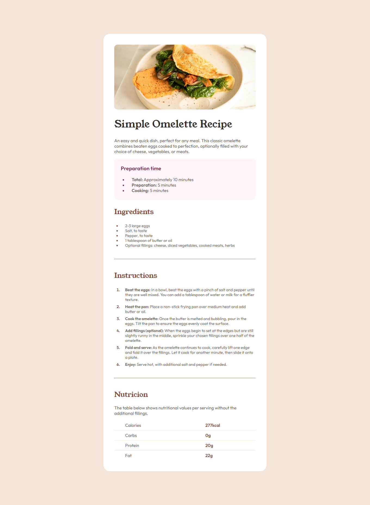

# Frontend Mentor - Recipe page solution

Esta é uma solução para o [Recipe page challenge on Frontend Mentor](https://www.frontendmentor.io/challenges/recipe-page-KiTsR8QQKm). Os desafios do Frontend Mentor ajudam você a melhorar suas habilidades de codificação criando projetos realistas.

## Índice

- [Visão geral](#visao-geral)
  - [O desafio](#o-desafio)
  - [Screenshot](#screenshot)
  - [Links](#links)
- [Meu processo](#meu-processo)
  - [Construido com](#construido-com)
  - [Recursos úteis](#recursos-uteis)
- [Autor](#autor)

## Visao geral

### Screenshot

### Links

- Solution URL: https://github.com/Erycky/Recipe-page]
- Live Site URL: https://erycky.github.io/Recipe-page/]

### Construido com

- HTML5 semântico
- CSS
- Flexbox
- CSS Grid

### Recursos úteis

- [Stack Overflow](https://stackoverflow.com/) - Me ajudou com dúvidas sobre como estilizar certos componentes e como utilizar certas tags.
- [W3Schools](https://www.w3schools.com/) - Me ajudou com dúvidas sobre como estilizar certos componentes e como utilizar certas tags.

## Autor

- Portfólio - [Erycky Rayner](https://erycky.github.io/Portfolio/)
- Frontend Mentor - [@Erycky](https://www.frontendmentor.io/profile/Erycky)
- LinkedIn - [Erycky Rayner](https://www.linkedin.com/in/eryckyraynerschmidt/)
- Instagram - [@mozdev\_](https://www.instagram.com/mozdev_/)
